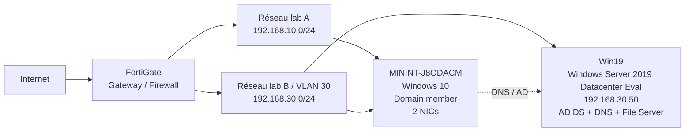

# Architecture — Windows Server / Active Directory Lab

Cette page décrit la topologie réellement utilisée dans le laboratoire personnel.

## Vue logique



## Inventaire confirmé

| Composant | Rôle | OS / Plateforme | Adresse | Notes |
|---|---|---|---|---|
| `Win19` | Domain Controller, DNS, File Server | Windows Server 2019 Datacenter Evaluation | `192.168.30.50/24` | IP statique |
| FortiGate | Gateway, firewall, VLAN, DHCP | FortiGate 80F | `192.168.10.1` et `192.168.30.1` | DHCP local confirmé sur plusieurs interfaces |
| `MININT-J8ODACM` | Poste membre du domaine | Windows 10 build 19045 | `192.168.10.124/24` + `192.168.30.52/24` | Deux NICs actives, toutes deux en DHCP |

## Domaine Active Directory

- **Domaine DNS :** `lab.local`
- **Nom NetBIOS :** `LAB`
- **Contrôleur de domaine :** `Win19.lab.local`
- **Forêt :** `lab.local`
- **Niveau fonctionnel du domaine :** Windows Server 2016
- **Niveau fonctionnel de la forêt :** Windows Server 2016
- **Global Catalog :** `Win19.lab.local`
- **Site AD :** `site-lab`
- **FSMO :** hébergés sur `Win19` dans ce lab à contrôleur unique

## Rôles Windows Server confirmés

Le serveur `Win19` héberge notamment :

- Active Directory Domain Services (AD DS)
- DNS Server
- File Server
- Group Policy Management Console (GPMC)
- Outils RSAT / module Active Directory PowerShell
- Windows Defender Antivirus

Le rôle DHCP n'est pas installé sur `Win19`.

## Structure logique Active Directory

OU observées dans le laboratoire :

```text
lab.local
├── Domain Controllers
├── Departement
├── Finance
├── Groups
├── HR
├── IT
├── Marketing
├── RD
├── Sales
└── Support
```

Le laboratoire contient également plusieurs comptes utilisateurs fictifs utilisés pour les tests d'administration, de stratégies et d'accès.

## Réseau

### VLAN 30 — `192.168.30.0/24`

Configuration vérifiée sur le FortiGate :

- **Interface :** `vlan30` / alias `Vlan30-VM`
- **VLAN ID :** `30`
- **Passerelle :** `192.168.30.1/24`
- **DC / DNS :** `192.168.30.50`
- **Client observé :** `192.168.30.52`
- **DHCP local FortiGate :** actif sur `vlan30`
- **Plage DHCP observée :** `192.168.30.50` à `192.168.30.200`
- **DNS distribué :** `192.168.30.50`
- **PXE next-server :** `192.168.30.51`
- **Boot file :** `SMSBoot\\LAB00002\\x64\\wdsnbp.com`

Le client `MININT-J8ODACM` confirme via `ipconfig /all` :

- IPv4 `192.168.30.52`
- passerelle `192.168.30.1`
- serveur DHCP vu par Windows `192.168.30.1`
- serveur DNS `192.168.30.50`

### Configuration obsolète découverte

L'interface `vlan30` contient encore :

```text
set dhcp-relay-service enable
set dhcp-relay-ip "192.168.30.245"
```

L'adresse `192.168.30.245` ne correspond à aucun serveur DHCP existant dans le laboratoire. Il s'agit d'une ancienne configuration de relay ajoutée par erreur et devenue obsolète.

Le service DHCP réellement utilisé sur VLAN30 est le **serveur DHCP local du FortiGate** (`config system dhcp server`, `edit 30`). Le comportement côté client le confirme : Windows identifie `192.168.30.1` comme serveur DHCP.

La correction consiste donc à supprimer le relay obsolète et à conserver le DHCP local FortiGate.

Autre point à corriger : la plage dynamique commence à `192.168.30.50`, alors que `192.168.30.50` est l'adresse statique du DC/DNS et `192.168.30.51` est configurée comme serveur PXE. Les adresses d'infrastructure doivent être exclues de la plage DHCP dynamique afin d'éviter les conflits.

### Réseau `192.168.10.0/24`

- **Passerelle :** `192.168.10.1` (FortiGate)
- **Client observé :** `192.168.10.124`
- **DHCP :** FortiGate
- **DNS distribué :** `192.168.30.50`

Le poste membre reçoit donc bien le DNS Active Directory `192.168.30.50` sur ses deux interfaces.

## Validation du client de domaine

Le poste `MININT-J8ODACM` est confirmé membre de `lab.local` :

- `PartOfDomain = True`
- secure channel AD valide (`Test-ComputerSecureChannel = True`)
- découverte du DC réussie via `nltest /dsgetdc:lab.local`
- DC découvert : `Win19.lab.local` (`192.168.30.50`)
- site AD détecté : `site-lab`
- la stratégie ordinateur est appliquée depuis `Win19.lab.local`
- `Default Domain Policy` apparaît dans les GPO ordinateur appliquées

Le compte utilisé pendant cette validation était le compte **local** `Administrator` du poste. L'absence de GPO utilisateur de domaine dans ce test est donc attendue.

## Point d'architecture à examiner

`MININT-J8ODACM` possède actuellement deux interfaces actives, chacune avec sa propre passerelle par défaut (`192.168.10.1` et `192.168.30.1`). Cette configuration fonctionne dans le test actuel, mais elle doit être examinée avant d'être présentée comme design final, car plusieurs routes par défaut sur un poste multihomé peuvent rendre le chemin réseau dépendant des métriques d'interface.

## Choix d'architecture

Le FortiGate assure les fonctions de passerelle, pare-feu, segmentation VLAN et DHCP pour le laboratoire. `Win19` possède une adresse statique car il fournit les services AD DS et DNS, qui doivent rester joignables de manière prévisible. Active Directory dépend fortement de DNS : les clients du domaine reçoivent donc `192.168.30.50` comme serveur DNS interne plutôt qu'un DNS public.

## À compléter

- supprimer le DHCP relay obsolète vers `192.168.30.245` et revalider le client ;
- exclure les adresses d'infrastructure de la plage DHCP dynamique ;
- expliquer le besoin des deux NICs sur `MININT-J8ODACM` et vérifier les métriques/routes ;
- ajouter une preuve visuelle finale de la configuration VLAN30/DHCP corrigée.
