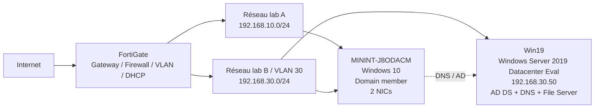

# Architecture — Windows Server / Active Directory Lab

Cette page décrit la topologie réellement utilisée dans le laboratoire personnel.

## Vue logique



## Inventaire

| Composant | Rôle | OS / Plateforme | Adresse | Notes |
|---|---|---|---|---|
| `Win19` | Domain Controller, DNS, File Server | Windows Server 2019 Datacenter Evaluation | `192.168.30.50/24` | IP statique |
| FortiGate | Gateway, firewall, VLAN, DHCP | FortiGate 80F | `192.168.10.1` et `192.168.30.1` | DHCP local |
| `MININT-J8ODACM` | Poste membre du domaine | Windows 10 build 19045 | `192.168.10.124/24` + `192.168.30.100/24` | Deux NICs utilisées pour les tests du lab |

## Domaine Active Directory

- **Domaine DNS :** `lab.local`
- **Nom NetBIOS :** `LAB`
- **Contrôleur de domaine :** `Win19.lab.local`
- **Forêt :** `lab.local`
- **Niveau fonctionnel du domaine :** Windows Server 2016
- **Niveau fonctionnel de la forêt :** Windows Server 2016
- **Global Catalog :** `Win19.lab.local`
- **Site AD :** `site-lab`
- **FSMO :** hébergés sur `Win19` dans ce lab à contrôleur unique

## Rôles Windows Server

Le serveur `Win19` héberge :

- Active Directory Domain Services (AD DS)
- DNS Server
- File Server
- Group Policy Management Console (GPMC)
- Outils RSAT / module Active Directory PowerShell
- Windows Defender Antivirus

Le rôle DHCP n'est pas installé sur `Win19`.

## Structure logique Active Directory

OU utilisées dans le laboratoire :

```text
lab.local
├── Domain Controllers
├── Departement
├── Finance
├── Groups
├── HR
├── IT
├── Marketing
├── RD
├── Sales
├── Support
└── Workstations
```

Le laboratoire contient également plusieurs comptes utilisateurs fictifs utilisés pour les tests d'administration, de stratégies et d'accès.

## Réseau

### VLAN 30 — `192.168.30.0/24`

Configuration finale vérifiée sur le FortiGate :

- **Interface :** `vlan30` / alias `Vlan30-VM`
- **VLAN ID :** `30`
- **Passerelle :** `192.168.30.1/24`
- **DC / DNS :** `192.168.30.50`
- **DHCP local FortiGate :** actif sur `vlan30`
- **Plage DHCP :** `192.168.30.100` à `192.168.30.200`
- **DNS distribué :** `192.168.30.50`

Le client `MININT-J8ODACM` confirme après renouvellement du bail :

- IPv4 `192.168.30.100`
- passerelle `192.168.30.1`
- serveur DHCP `192.168.30.1`
- serveur DNS `192.168.30.50`

### Audit et correction DHCP

L'audit a révélé deux problèmes :

1. un ancien DHCP Relay vers `192.168.30.245`, adresse qui ne correspond à aucun serveur du laboratoire ;
2. une plage DHCP qui commençait à `192.168.30.50`, alors que cette adresse est utilisée statiquement par le DC/DNS.

Corrections appliquées :

- suppression du DHCP Relay obsolète ;
- conservation du serveur DHCP local FortiGate ;
- déplacement de la plage dynamique vers `192.168.30.100-192.168.30.200` afin de séparer les adresses d'infrastructure des adresses clientes.

La validation finale côté client confirme la nouvelle plage, la passerelle et le DNS Active Directory.

### Réseau `192.168.10.0/24`

- **Passerelle :** `192.168.10.1` (FortiGate)
- **Client observé :** `192.168.10.124`
- **DHCP :** FortiGate
- **DNS distribué :** `192.168.30.50`

Le poste membre reçoit donc bien le DNS Active Directory `192.168.30.50` sur ses deux interfaces.

## Validation du client de domaine

Le poste `MININT-J8ODACM` est confirmé membre de `lab.local` :

- `PartOfDomain = True`
- secure channel AD valide (`Test-ComputerSecureChannel = True`)
- découverte du DC réussie via `nltest /dsgetdc:lab.local`
- DC découvert : `Win19.lab.local` (`192.168.30.50`)
- site AD détecté : `site-lab`
- `LAB-Workstations-Test` et `Default Domain Policy` validées côté ordinateur

## Note sur le poste multihomé

`MININT-J8ODACM` utilise deux interfaces réseau dans le cadre du laboratoire afin de tester les deux segments `192.168.10.0/24` et `192.168.30.0/24`. Cette configuration est propre au lab et n'est pas présentée comme un modèle de poste utilisateur en production.

## Choix d'architecture

Le FortiGate assure les fonctions de passerelle, pare-feu, segmentation VLAN et DHCP. `Win19` possède une adresse statique car il fournit les services AD DS et DNS. Les clients du domaine utilisent `192.168.30.50` comme DNS interne afin de permettre la résolution des enregistrements Active Directory et la découverte du contrôleur de domaine.
