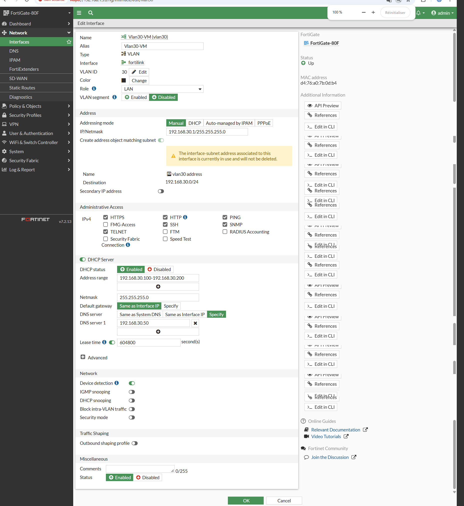
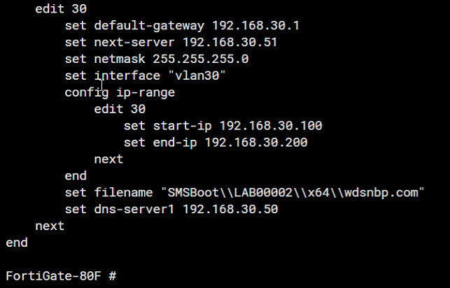
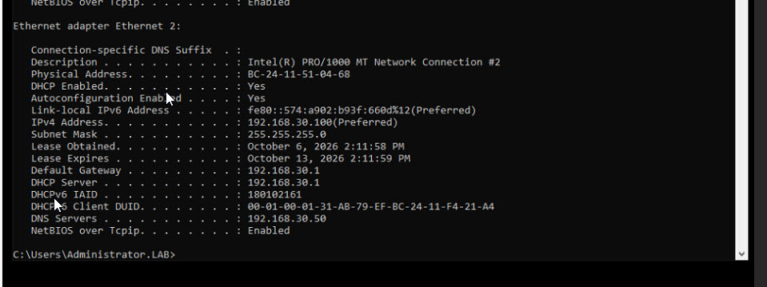

# Projet 01 — Windows Server & Active Directory

## Objectif

Construire, administrer et dépanner un environnement Windows Server avec Active Directory, DNS, GPO, permissions de fichiers et intégration réseau FortiGate.

Le projet s'appuie sur des configurations réelles du lab, des commandes de validation, des captures et plusieurs scénarios de dépannage reproduits puis corrigés.

## Environnement

- `Win19` — Windows Server 2019, contrôleur de domaine, DNS et File Server ;
- domaine `lab.local` ;
- FortiGate 80F — passerelle, firewall, VLAN et DHCP ;
- `MININT-J8ODACM` — poste Windows 10 membre du domaine ;
- réseaux `192.168.10.0/24` et `192.168.30.0/24`.

Architecture détaillée : [ARCHITECTURE.md](ARCHITECTURE.md)

## Active Directory et GPO

Le poste client a été validé comme membre du domaine avec secure channel fonctionnel et découverte correcte du contrôleur de domaine.

Une GPO personnalisée `LAB-Workstations-Test` a été créée et liée à l'OU `Workstations`.

Le scénario GPO reproduit volontairement un problème de **Security Filtering** :

- la GPO reste liée à la bonne OU ;
- le groupe `GG-GPO-Pilot` possède le droit d'appliquer la stratégie ;
- le compte ordinateur n'est initialement pas membre du groupe ;
- `gpresult` confirme que la GPO n'est plus appliquée ;
- le poste est ajouté au groupe ;
- après renouvellement du contexte de sécurité machine, la GPO est de nouveau appliquée.

Documentation :

- [Validation du client](CLIENT-VALIDATION.md)
- [Validation GPO](GPO-VALIDATION.md)
- [Scénario GPO](GPO-SCENARIO-SUMMARY.md)

## SMB / NTFS et AGDLP

Un partage `\\Win19\Finance` a été configuré selon le modèle :

```text
Utilisateur
  ↓
GRP-Finance-Users          (Global Security)
  ↓
DL-Finance-RW              (Domain Local Security)
  ↓
Permissions SMB / NTFS
```

Le scénario couvre :

- permissions SMB `Change` ;
- permissions NTFS `Modify` ;
- validation avec un utilisateur autorisé ;
- reproduction d'un `Access is denied` ;
- distinction entre authentification et autorisation ;
- correction de l'appartenance au groupe ;
- impact d'une ancienne session SMB sur le contexte d'autorisation ;
- validation finale en lecture et écriture.

Documentation : [SMB-NTFS-SCENARIO-SUMMARY.md](SMB-NTFS-SCENARIO-SUMMARY.md)

## Réseau / VLAN30 / DHCP

Configuration finale validée :

- interface `vlan30` / alias `Vlan30-VM` ;
- VLAN ID `30` ;
- passerelle `192.168.30.1/24` ;
- DHCP local FortiGate actif ;
- plage DHCP `192.168.30.100` à `192.168.30.200` ;
- DNS Active Directory distribué : `192.168.30.50`.

Après renouvellement du bail, `MININT-J8ODACM` confirme :

- IPv4 `192.168.30.100` ;
- passerelle `192.168.30.1` ;
- serveur DHCP `192.168.30.1` ;
- DNS `192.168.30.50`.

L'audit a permis d'identifier puis de corriger :

- un ancien DHCP Relay vers `192.168.30.245`, sans serveur correspondant dans le lab ;
- une plage DHCP initiale qui incluait l'adresse statique du DC/DNS `192.168.30.50`.

Le relay obsolète a été supprimé et la plage cliente déplacée vers `.100-.200`.

## DNS et découverte Active Directory

Le DNS du client a été volontairement remplacé par une adresse incorrecte afin de reproduire une panne de découverte Active Directory.

Symptômes observés :

- `Resolve-DnsName Win19.lab.local` en timeout ;
- `nltest /dsgetdc:lab.local /force` retourne `ERROR_NO_SUCH_DOMAIN` ;
- `gpupdate /force` échoue côté stratégie ordinateur ;
- le contrôleur de domaine reste joignable par IP.

Le diagnostic a permis de distinguer **connectivité IP**, **service DNS**, **résolution de noms**, **découverte du DC** et **fonctionnement GPO**.

Après restauration de `192.168.30.50` comme DNS du client, les services AD ont été validés à nouveau.

Documentation : [DNS-SCENARIO-SUMMARY.md](DNS-SCENARIO-SUMMARY.md)

## Troubleshooting

Synthèse des incidents : [TROUBLESHOOTING.md](TROUBLESHOOTING.md)

```text
Symptôme
  ↓
Tests ciblés
  ↓
Isolation de la couche en panne
  ↓
Cause racine
  ↓
Correction contrôlée
  ↓
Validation finale
```

## Preuves visuelles

### Active Directory / GPO


### SMB / NTFS / AGDLP


### DNS / Active Directory


### FortiGate / VLAN30 / DHCP



La configuration GUI confirme l'interface VLAN30, la passerelle `192.168.30.1`, la plage `192.168.30.100-192.168.30.200` et le DNS AD `192.168.30.50`.



La sortie CLI confirme le scope DHCP final et le DNS distribué.



Après renouvellement du bail, le client reçoit une adresse de la nouvelle plage, la passerelle/DHCP `192.168.30.1` et le DNS AD `192.168.30.50`.

## PowerShell

Un script non destructif d'audit Active Directory est disponible dans [`scripts/powershell`](../../scripts/powershell/README.md).

## Compétences mises en pratique

- administration d'un domaine Windows ;
- gestion des OU, groupes, postes et stratégies ;
- DNS Active Directory ;
- Group Policy et Security Filtering ;
- permissions SMB vs NTFS ;
- modèle AGDLP ;
- segmentation VLAN et DHCP ;
- audit et correction d'une configuration réseau ;
- PowerShell ;
- diagnostic structuré et validation avant/après.

## Sécurité

Toutes les données présentées proviennent du laboratoire personnel. Aucun environnement d'employeur ou de client n'est utilisé dans ce projet.
