# Projet 01 — Windows Server & Active Directory

## Objectif

Construire, administrer et dépanner un environnement Windows Server afin de démontrer des compétences directement transférables vers un poste de technicien infrastructure ou administrateur systèmes junior.

Ce projet est basé sur des **preuves réelles de laboratoire** : architecture, commandes, captures sanitisées et scénarios de dépannage reproduits puis corrigés.

## Environnement

- `Win19` — Windows Server 2019, contrôleur de domaine, DNS et File Server ;
- domaine `lab.local` ;
- FortiGate 80F — passerelle, firewall, VLAN et DHCP ;
- `MININT-J8ODACM` — poste Windows 10 membre du domaine ;
- réseaux de lab `192.168.10.0/24` et `192.168.30.0/24`.

Architecture détaillée : [ARCHITECTURE.md](ARCHITECTURE.md)

## Active Directory et GPO

Le poste client a été validé comme membre du domaine avec secure channel fonctionnel et découverte correcte du contrôleur de domaine.

Une GPO personnalisée `LAB-Workstations-Test` a ensuite été créée et liée à l'OU `Workstations`.

Le scénario de dépannage GPO reproduit volontairement un problème de **Security Filtering** :

- la GPO reste liée à la bonne OU ;
- le groupe `GG-GPO-Pilot` possède le droit d'appliquer la stratégie ;
- le compte ordinateur n'est initialement pas membre du groupe ;
- `gpresult` confirme que la GPO n'est plus appliquée ;
- le poste est ajouté au groupe ;
- après renouvellement du contexte de sécurité machine, la GPO est de nouveau appliquée.

Documentation :

- [Validation du client](CLIENT-VALIDATION.md)
- [Validation GPO](GPO-VALIDATION.md)
- [Scénario GPO](GPO-SCENARIO-SUMMARY.md)

## SMB / NTFS et AGDLP

Un partage `\\Win19\Finance` a été configuré selon le modèle :

```text
Utilisateur
  ↓
GRP-Finance-Users          (Global Security)
  ↓
DL-Finance-RW              (Domain Local Security)
  ↓
Permissions SMB / NTFS
```

Le scénario démontre :

- permissions SMB `Change` ;
- permissions NTFS `Modify` ;
- validation avec un utilisateur autorisé ;
- reproduction d'un `Access is denied` ;
- distinction entre authentification et autorisation ;
- correction de l'appartenance au groupe ;
- impact d'une ancienne session SMB sur le contexte d'autorisation ;
- validation finale en lecture et écriture.

Documentation : [SMB-NTFS-SCENARIO-SUMMARY.md](SMB-NTFS-SCENARIO-SUMMARY.md)

## Réseau / VLAN30 / DHCP

Le VLAN30 a été vérifié directement sur le FortiGate et depuis le poste client.

Configuration observée :

- interface `vlan30` / alias `Vlan30-VM` ;
- VLAN ID `30` ;
- passerelle `192.168.30.1/24` ;
- serveur DNS Active Directory distribué : `192.168.30.50` ;
- client `MININT-J8ODACM` : `192.168.30.52` ;
- DHCP local FortiGate actif sur `vlan30` ;
- plage DHCP observée : `192.168.30.50` à `192.168.30.200` ;
- PXE `next-server` : `192.168.30.51` ;
- boot file MECM/PXE : `SMSBoot\\LAB00002\\x64\\wdsnbp.com`.

Le client confirme via `ipconfig /all` :

- passerelle `192.168.30.1` ;
- serveur DHCP vu par Windows `192.168.30.1` ;
- DNS `192.168.30.50`.

L'audit de configuration a également révélé un **DHCP Relay vers `192.168.30.245` configuré simultanément avec le serveur DHCP local** sur la même interface. Ce point est documenté comme anomalie à corriger.

Autre amélioration identifiée : les IP d'infrastructure `192.168.30.50` (DC/DNS) et `192.168.30.51` (PXE) se trouvent actuellement dans la plage DHCP dynamique. Elles doivent être exclues afin d'éviter les conflits d'adresses.

Cette découverte est volontairement conservée dans le portfolio : elle démontre une démarche d'audit réelle plutôt qu'une architecture présentée artificiellement comme parfaite.

## DNS et découverte Active Directory

Le DNS du client a été volontairement remplacé par une adresse incorrecte afin de reproduire une panne de découverte Active Directory.

Symptômes observés :

- `Resolve-DnsName Win19.lab.local` en timeout ;
- `nltest /dsgetdc:lab.local /force` retourne `ERROR_NO_SUCH_DOMAIN` ;
- `gpupdate /force` échoue côté stratégie ordinateur ;
- le contrôleur de domaine reste néanmoins joignable par IP.

Le diagnostic a permis de distinguer **connectivité IP**, **service DNS**, **résolution de noms**, **découverte du DC** et **fonctionnement GPO**.

Après restauration de `192.168.30.50` comme DNS du client, les services AD ont été validés à nouveau.

Documentation : [DNS-SCENARIO-SUMMARY.md](DNS-SCENARIO-SUMMARY.md)

## Troubleshooting

Vue synthétique des incidents : [TROUBLESHOOTING.md](TROUBLESHOOTING.md)

Méthode utilisée :

```text
Symptôme
  ↓
Tests ciblés
  ↓
Isolation de la couche en panne
  ↓
Cause racine
  ↓
Correction contrôlée
  ↓
Validation finale
```

## Preuves visuelles

### Active Directory / GPO

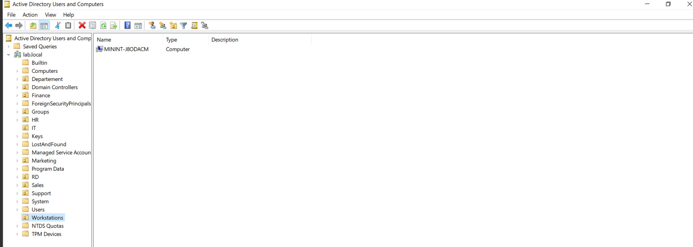

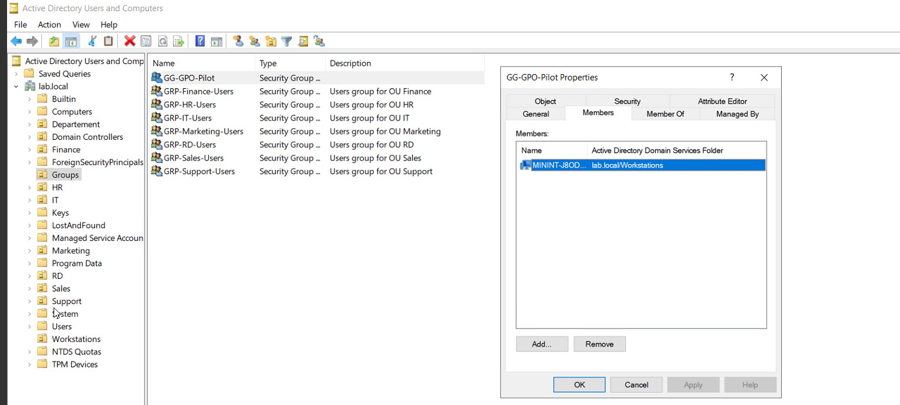

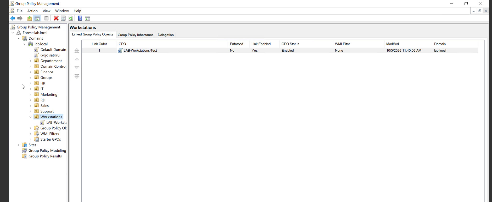

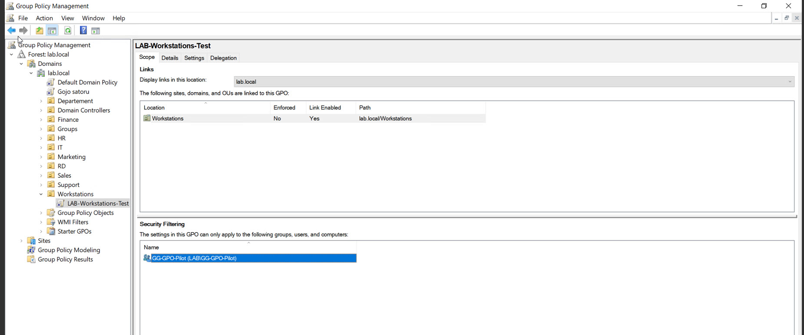

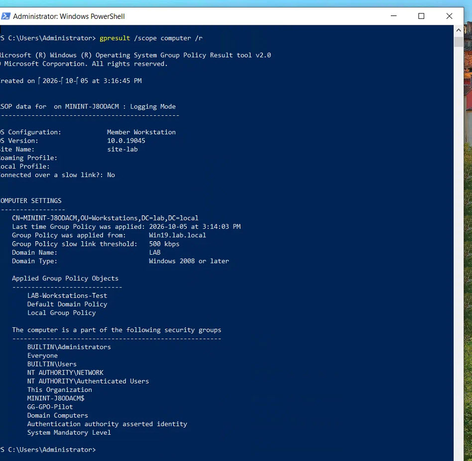

### SMB / NTFS / AGDLP

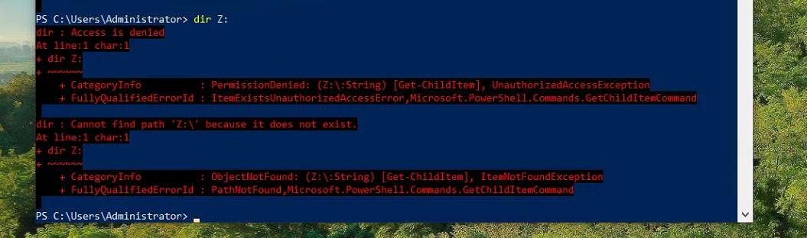

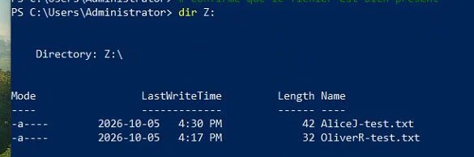

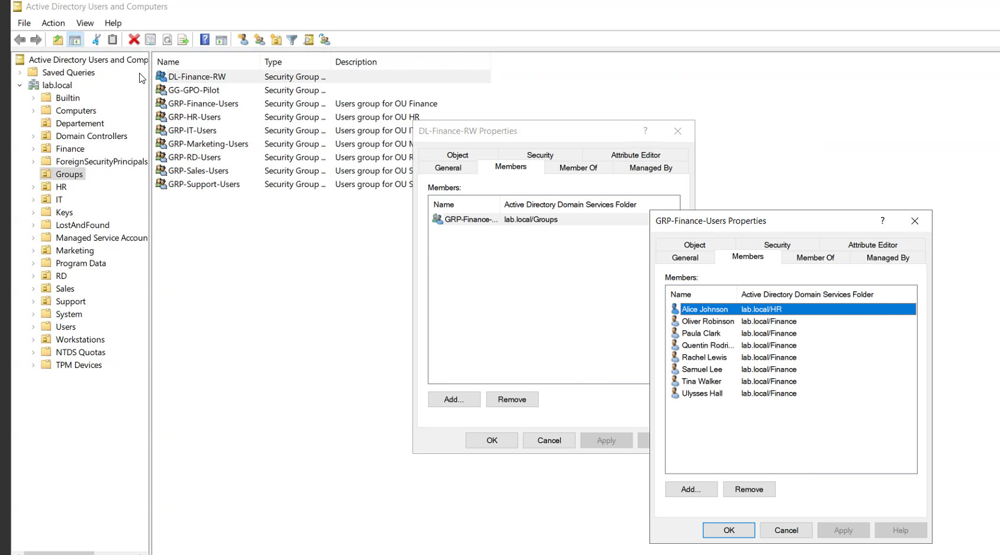

### DNS / Active Directory

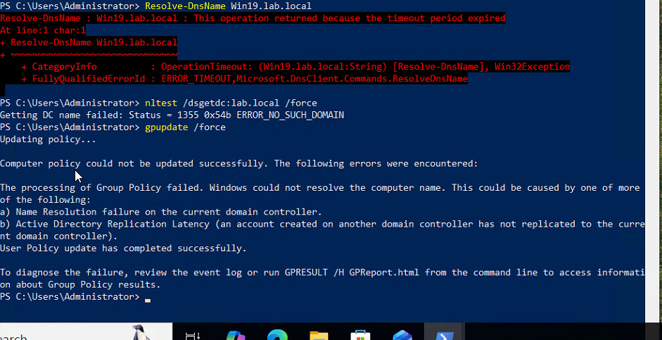

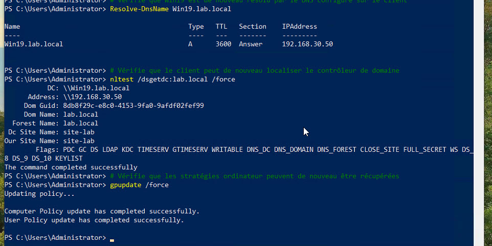

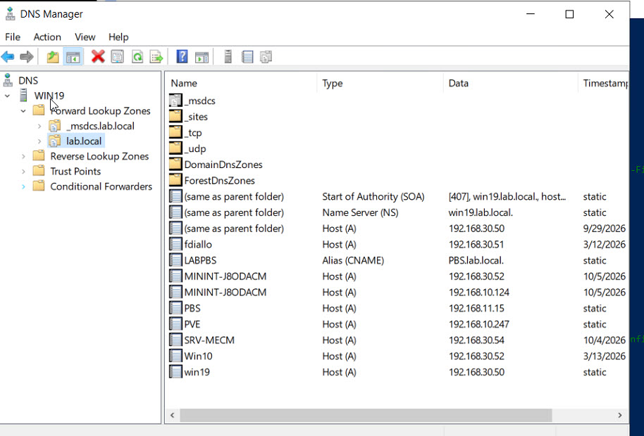

## PowerShell

Un script non destructif d'audit Active Directory est publié dans [`scripts/powershell`](../../scripts/powershell/README.md).

## Ce que ce projet démontre

- administration d'un domaine Windows ;
- gestion des OU, groupes, postes et stratégies ;
- compréhension du rôle critique de DNS dans Active Directory ;
- ciblage de GPO et Security Filtering ;
- permissions SMB vs NTFS ;
- modèle AGDLP ;
- segmentation VLAN et validation DHCP/DNS ;
- identification d'anomalies de configuration réseau ;
- distinction authentification / autorisation ;
- utilisation de PowerShell ;
- dépannage structuré basé sur des preuves ;
- documentation technique exploitable en entretien.

## Sécurité

Toutes les données présentées proviennent du laboratoire personnel. Aucun environnement d'employeur ou de client n'est utilisé dans ce projet.
